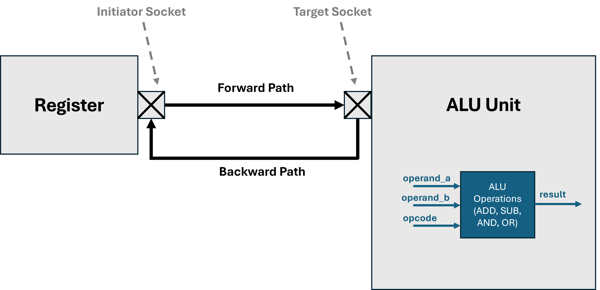

# SystemC Models

This repository contains example SystemC modules, starting from very simple to more advanced designs.

## ⚙ Requirements
To build and run the examples you will need:

* SystemC 2.3.3

* GTKWave (for viewing waveform .vcd files)

## 📂 Current Modules

|   | Module Name | 
|----|-------------|
| 01 | Comparator
| 02 | Policer
| 03 | BCD Counter
| 04 | Sampler
| 05 | FIFO with sc_interface
| 06 | FIFO with TLM
| 07 | Reg → ALU (8-bit)


## Reg → ALU (8-bit) — SystemC TLM-2.0 Mini Model

A minimal TLM-2.0 example showing a register block (initiator) sending random operands and an opcode to an ALU target, which computes the result in a submodule and returns it. Internal ALU signals are traced to GTKWave for easy inspection.

* TLM-2.0 non-blocking 2-phase flow: BEGIN_REQ/END_REQ → BEGIN_RESP/END_RESP
* Clean separation: target (alu) delegates to a combinational submodule (alu_functions)
* Observability: internal SystemC signals traced to VCD and viewed in GTKWave



**Opcode map (2 bits):**
00 = ADD, 01 = SUB, 10 = AND, 11 = OR (8-bit, wrap-around arithmetic).

## 🛠 How to Build & Run

Each module folder contains its own **Makefile**.

Navigate into the module’s folder and run:
```bash
cd 07_alu_reg_8bit
make
```
This will compile the source files in that folder and produce an executable, for example: **alu_8bit.x.x**

After building, run:

```bash
./alu_8bit.x.x
```

This generate a VCD waveform file in the same folder (e.g., alu_unit.vcd).

```bash
gtkwave alu_unit.vcd
```